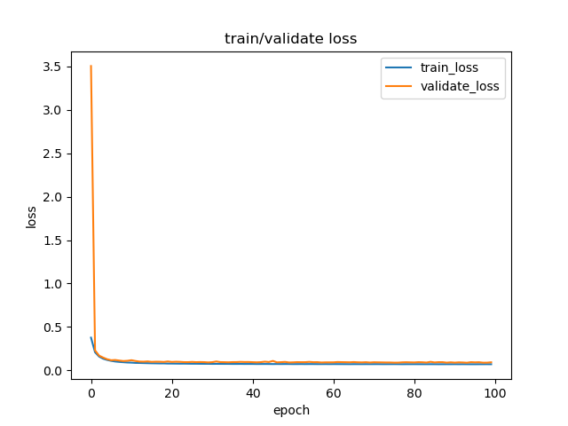
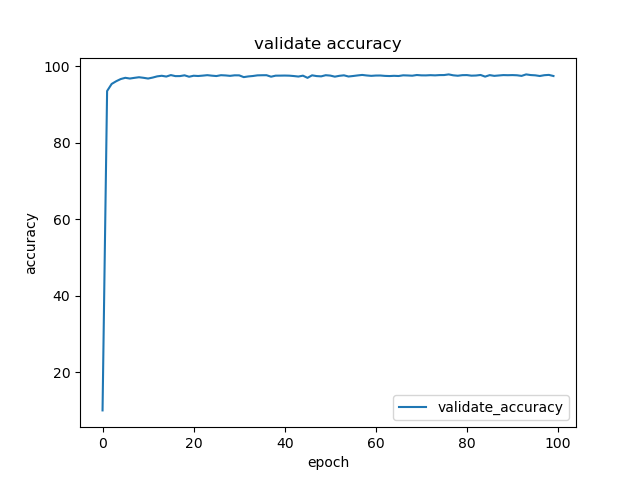
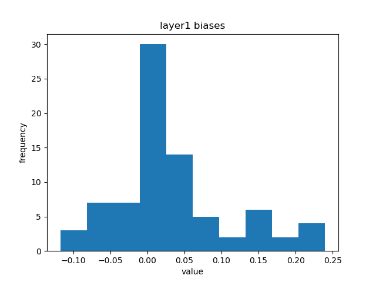
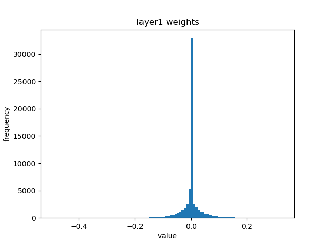
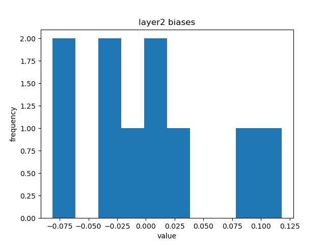
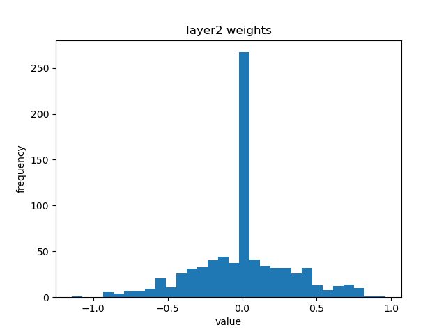

# 使用numpy构建两层神经网络分类器

《神经网络和深度学习》课程作业

21210980049 林恒旭

Github地址：[KomorebiLHX/Neural-Network-Numpy: 使用Numpy构建两层神经网络分类器 (github.com)](https://github.com/KomorebiLHX/Neural-Network-Numpy)

## 运行方式

```bash
python main.py
```

主程序会

1. 进行参数查找，保存查找到的最佳模型。
2. 导入最佳模型，在测试集上测试获得精度。
3. 可视化训练和测试的loss曲线，测试的accuracy曲线，以及可视化每层的网络参数，并保存至figs文件夹。

## 作业要求及其实现

### 训练

1. 激活函数：activations.py
2. 反向传播，loss以及梯度的计算：model.backward方法
3. 学习率下降策略：optimizer.py
4. L2正则化：采用weight_dacay进行实现，optimizer.step
5. 优化器SGD：optimizer.py
6. 保存模型：model.save
7. 训练主函数为utils.fit，训练记录在logs文件夹中

### 参数查找：学习率，隐藏层大小，正则化强度

1. 学习率查找范围为[5e-3, 1e-2, 2e-2]，隐藏层大小查找范围为[20, 30, 40]，正则化强度查找范围为[0, 1e-2, 2e-2]，已在main.py中实现
2. 最佳模型的超参数为：

```python
best_config = {'accuracy': 96.77, 'layer': [784, 40, 10], 'learning_rate': 0.02, 'weight_decay': 0}
```


### 测试：导入模型，用经过参数查找后的模型进行测试，输出分类精度

已在main.py中实现，其中测试主函数为utils.test

### 可视化

1. 主函数为utils.visualize
2. 采用折线图对loss和accuracy可视化，采用直方图对网络每层参数进行可视化
3. 结果保存在figs文件夹中














 ## 模型链接

链接：https://pan.baidu.com/s/1qNUEbzj1aAfh4EaMVeEo7A 
提取码：uewz

注意：将models文件解压后，要放在models文件夹中

